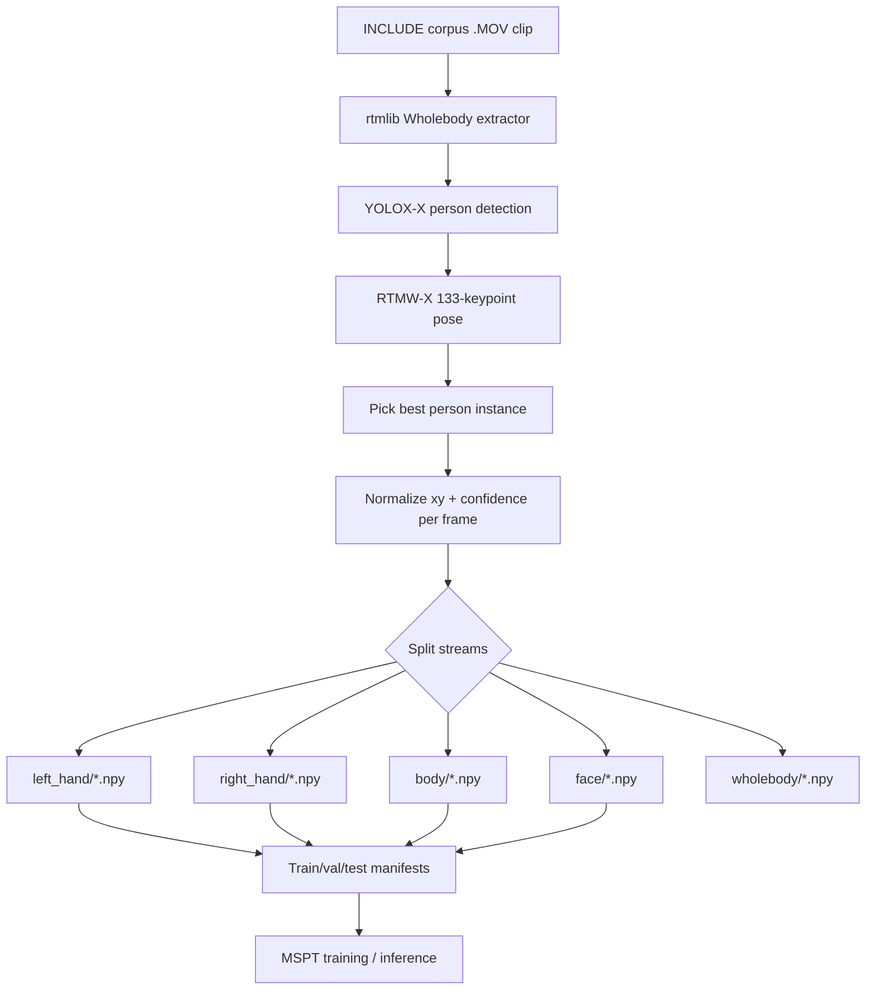
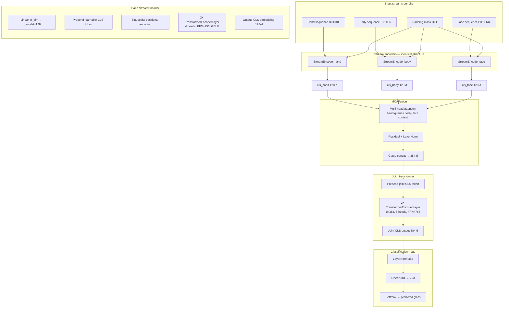
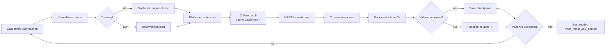
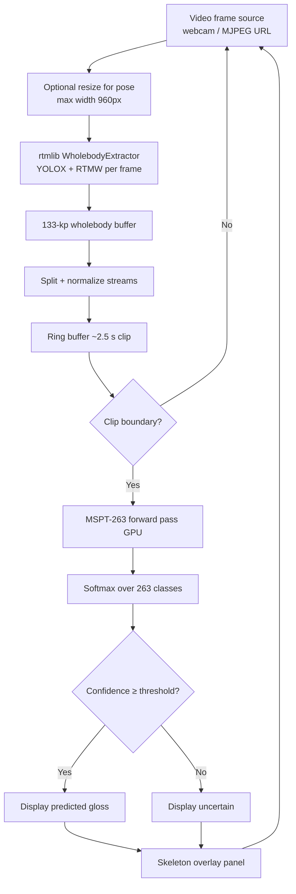
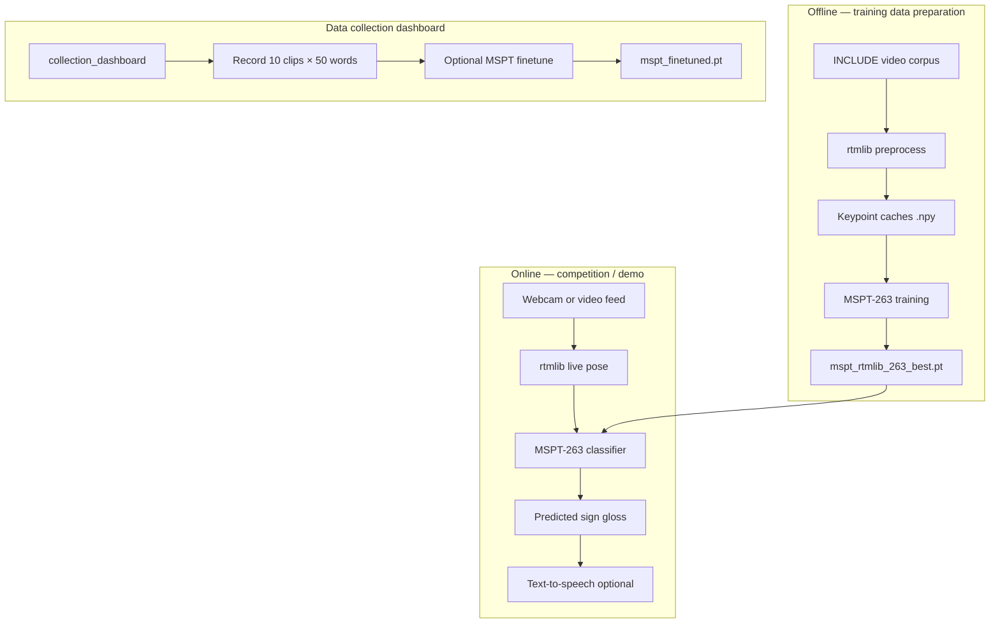

# Sign2Sound — RTMLib MSPT-263 Technical Document

**Team Kaizen · Sign Language Recognition · Competition Technical Brief**

| Field | Value |
|-------|-------|
| **Model name** | MSPT-RTMLib-263 (Multi-Stream Pose Transformer) |
| **Checkpoint** | `checkpoints/mspt/mspt_rtmlib_263_best.pt` |
| **Output classes** | 263 isolated sign glosses |
| **Validation accuracy (best)** | **94.30%** (epoch 31, early stopping) |
| **Parameters** | 3,554,823 (~13.6 MB FP32) |
| **Pose backend** | rtmlib — YOLOX-X + RTMW-X (COCO-WholeBody 133 keypoints) |
| **Repository path** | `~/Arrakis/Sign2Sound_Kaizen/` |

---

## 1. Executive Summary

Sign2Sound uses a **Multi-Stream Pose Transformer (MSPT)** that classifies isolated sign language clips from **three synchronized pose streams**: hands, upper body, and face. Unlike the original Kaizen BiLSTM pipeline (25 ISL letters, MediaPipe hand landmarks only), the competition model:

1. Extracts **133 whole-body keypoints** per frame using **rtmlib** (YOLOX-X person detection + RTMW-X pose estimation).
2. Normalizes and splits keypoints into hand / body / face tensors.
3. Encodes each stream with a **Transformer encoder**, fuses them with **multi-stream cross-attention (MCA)**, and predicts one of **263 gloss labels**.

The vocabulary covers the **INCLUDE-50 MSPT subset** (50 competition words) plus **213 additional glosses** from the broader INCLUDE corpus (INCLUDE-263), enabling richer pre-training and generalization.

---

## 2. Vocabulary & Dataset

### 2.1 Class structure

| Split | Clips | Purpose |
|-------|-------|---------|
| Train | 3,498 | Model training (+ 8× stochastic augmentation) |
| Validation | 386 | Early stopping & checkpoint selection |
| Test | 374 | Held-out evaluation |
| **Total** | **4,258** | All preprocessed rtmlib clips |

- **263 classes** total (`data/include50_rtmlib_1080/lab_summary.json`)
- **50 classes** are the INCLUDE-50 MSPT competition words (`include50_words.csv`, `label_id` 0–49)
- **213 classes** are extended INCLUDE glosses (`label_id` 50–262)
- Full gloss list: `scripts/mspt/include50_mspt_and_include263_vocabulary.csv`

### 2.2 Source video properties

From preprocessing metadata (`data/include50_rtmlib_1080/metrics.json`):

| Property | Value |
|----------|-------|
| Resolution | Native 1080p (median 1920×1080), no resize |
| Frame rate | Native (all frames retained) |
| Keypoint schema | COCO-WholeBody 133 |
| Hand detection rate | 100% of processed frames |
| Total frames (corpus) | 213,781 |

---

## 3. Preprocessing Pipeline (RTMLib)

Each `.MOV` clip from the INCLUDE corpus is processed offline into per-stream `.npy` caches under `data/include50_rtmlib_1080/cache/`.

### 3.1 Pose extraction stack

| Component | Model | Input size |
|-----------|-------|------------|
| Person detection | YOLOX-X (`yolox_x_8xb8-300e_humanart`) | 640×640 |
| Whole-body pose | RTMW-X SimCC (`rtmw-x_384x288`) | 288×384 |
| Runtime | ONNX Runtime GPU 1.20.2 | CUDA when available |

Implementation: `mspt/rtmlib_preprocess.py` → class `RtmlibWholebodyExtractor`

### 3.2 Keypoint layout (133 → 3 streams)

```
COCO-WholeBody 133 keypoints per frame
├── body      indices  0–16  (17 COCO body joints)  → padded to 33 for MSPT
├── foot      indices 17–22  (stored, not used in MSPT)
├── face      indices 23–90  (68 iBUG face landmarks) → padded to 72 for MSPT
├── left_hand indices 91–111 (21 hand joints)
└── right_hand indices 112–132 (21 hand joints)
```

Each keypoint is stored as `(x_norm, y_norm, confidence, valid)` in `[0, 1]` normalized image coordinates.

### 3.3 Per-stream normalization

Applied at load time (`mspt/rtmlib_io.py`, `mspt/normalize.py`):

| Stream | Joints | Normalization |
|--------|--------|---------------|
| **Hands** | 42 (21L + 21R) | Wrist anchor, scale by wrist→middle-finger-tip distance |
| **Body** | 17 → pad 33 | Hip-midpoint anchor, shoulder-width scale |
| **Face** | 68 → pad 72 | Nose anchor, inter-eye distance scale |

Long clips are **uniformly subsampled** to `max_seq_len = 96` frames.

### 3.4 Preprocessing flowchart



---

## 4. Model Architecture — MSPT

**MSPT** (Multi-Stream Pose Transformer) is defined in `mspt/model.py`. It processes three temporal keypoint streams in parallel, fuses them, and outputs a single gloss prediction per clip.

### 4.1 Input tensor shapes

After flattening normalized `(x, y)` coordinates:

| Stream | Shape per timestep | Flat dim | Description |
|--------|-------------------|----------|-------------|
| Hand | `(42, 2)` | **84** | Both hands |
| Body | `(33, 2)` | **66** | COCO-17 padded |
| Face | `(72, 2)` | **144** | iBUG-68 padded |
| Mask | `(T,)` | — | 1 = valid frame, 0 = pad |

Batch input after collation: `(B, T, dim)` where `T ≤ 96`.

### 4.2 Architecture diagram



### 4.3 Component specifications

| Module | Configuration |
|--------|---------------|
| **StreamEncoder** (×3) | `d_model=128`, `nhead=4`, `num_layers=2`, `dim_feedforward=256`, dropout=0.1, GELU |
| **Positional encoding** | Sinusoidal, max length 128 (+1 CLS) |
| **MCAFusion** | 4-head cross-attention (hand → body+face), LayerNorm residual, sigmoid gate on 384-d concat |
| **Joint encoder** | 2 layers, `d_model=384`, `nhead=8`, `dim_feedforward=768`, dropout=0.3 |
| **Classifier** | LayerNorm → Linear(384, 263) |
| **Memory optimizations** | Sequential stream encoding, gradient checkpointing (training), AMP FP16 |

### 4.4 Design rationale

- **Multi-stream**: Sign language depends on hand shape, body posture, and facial expression; separate encoders let each modality develop its own temporal representation before fusion.
- **Hand-centric fusion**: MCA uses the hand CLS token as the query attending to body and face context, reflecting that hand motion is primary for gloss discrimination while body/face provide disambiguating context.
- **CLS-based pooling**: Each stream compresses variable-length sequences into a fixed embedding via a learnable CLS token (ViT-style), avoiding late RNN bottlenecks.
- **263-class head**: Extended vocabulary beyond the 50 competition words improves representation learning on diverse INCLUDE footage.

---

## 5. Training

### 5.1 Training configuration

| Hyperparameter | Value |
|----------------|-------|
| Optimizer | AdamW (lr=1e-4, weight decay=1e-3) |
| Scheduler | Cosine annealing (T_max=150) |
| Loss | Cross-entropy with label smoothing 0.05 |
| Micro-batch size | 4 |
| Gradient accumulation | 8 (effective batch = **32**) |
| Max sequence length | 96 frames |
| Augmentation repeat | 8× (stochastic, training only) |
| Max epochs | 150 |
| Early stopping patience | 20 (validation accuracy) |
| Mixed precision | FP16 (CUDA AMP) |
| Gradient clipping | max norm 1.0 |
| Hardware target | ~4 GB VRAM / 8 GB RAM |

Training entry point: `scripts/mspt/run_mspt.py --rtmlib --ckpt-name mspt_rtmlib_263_best.pt --num-classes 263`

### 5.2 Data augmentation (training only)

Applied jointly across all three streams (`mspt/augment.py`):

| Augmentation | Description |
|--------------|-------------|
| Horizontal flip | 50% — mirror x, swap left/right hand blocks and body pairs |
| Gaussian jitter | σ=0.02 on valid keypoints |
| Skeleton scale | Uniform 0.8–1.2× |
| Temporal dropout | 10% frame zeroing |
| Temporal resample | 0.8–1.2× speed (aligned across streams) |
| SPOTER perspective | Weak 2D perspective warp (shift ±0.15, scale ±0.2) |

### 5.3 Training flowchart



### 5.4 Training results

| Metric | Value | Source |
|--------|-------|--------|
| Best validation accuracy | **94.30%** | Checkpoint metadata, epoch 31 |
| Training stopped | Epoch 31 | Early stopping (patience 20) |
| Parameters | 3,554,823 | Model state dict |

> **Note:** Test-split accuracy was not persisted in the saved checkpoint (`test_acc: null`). Re-evaluation can be run with:
> ```bash
> cd ~/Arrakis/Sign2Sound_Kaizen
> export PYTHONPATH=$PWD:$PWD/scripts/mspt
> python scripts/mspt/run_mspt.py --rtmlib --eval-only \
>   --checkpoint checkpoints/mspt/mspt_rtmlib_263_best.pt \
>   --lab-root data/include50_rtmlib_1080 --num-classes 263
> ```

### 5.5 Related checkpoints

| Checkpoint | Classes | Val accuracy | Notes |
|------------|---------|--------------|-------|
| `mspt_rtmlib_263_best.pt` | 263 | **94.30%** | **Latest / production model** |
| `mspt_rtmlib_1080_best.pt` | 50* | 92.00% | rtmlib backend, INCLUDE-50 only |
| `mspt_best.pt` | 50 | 78.29% | MediaPipe backend baseline |

\*1080 checkpoint predates explicit `num_classes` field; trained on rtmlib 1080p INCLUDE-50 layout.

---

## 6. Inference Pipeline

### 6.1 Offline evaluation

```
scripts/mspt/eval_confusion_matrix.py --rtmlib --split test
```

Produces confusion matrix PNG + per-class JSON under `collection_dashboard/evals/` (when generated).

### 6.2 Live inference

Entry point: `scripts/mspt/rtmlib_live_mspt.py`

```bash
cd ~/Arrakis/Sign2Sound_Kaizen
export PYTHONPATH=$PWD:$PWD/scripts/mspt
python scripts/mspt/rtmlib_live_mspt.py \
  --checkpoint checkpoints/mspt/mspt_rtmlib_263_best.pt \
  --lab-root data/include50_rtmlib_1080 \
  --video-url http://localhost:8080/video
```

### 6.3 Live inference flowchart



Default live settings:

| Parameter | Default |
|-----------|---------|
| Clip duration | 2.5 s |
| Gap between clips | 1.0 s |
| Capture FPS | 10 |
| Min confidence | 0.12 (263-way softmax is naturally diffuse) |
| Prediction hold | 2.0 s on screen |

---

## 7. End-to-End System Overview



---

## 8. Repository Layout

| Path | Description |
|------|-------------|
| `mspt/model.py` | MSPT architecture |
| `mspt/rtmlib_preprocess.py` | rtmlib extraction & wholebody splitting |
| `mspt/rtmlib_io.py` | Cache loading & normalization |
| `mspt/rtmlib_dataset.py` | PyTorch dataset for rtmlib caches |
| `mspt/augment.py` | Training augmentations |
| `scripts/mspt/run_mspt.py` | Training & evaluation CLI |
| `scripts/mspt/rtmlib_live_mspt.py` | Live GPU inference |
| `scripts/mspt/eval_confusion_matrix.py` | Confusion matrix generation |
| `data/include50_rtmlib_1080/` | Preprocessed lab (caches + manifests) |
| `checkpoints/mspt/mspt_rtmlib_263_best.pt` | **Production checkpoint** |
| `collection_dashboard/` | Web UI for data collection |
| `weights/mediapipe/` | Legacy MediaPipe models (fallback viz) |
| `include50_words.csv` | 50 competition word list |

---

## 9. Dependencies

Core Python packages (`scripts/mspt/requirements-rtmlib.txt`):

```
rtmlib>=0.0.13
opencv-python>=4.8.0
numpy>=1.26.0
onnxruntime-gpu==1.20.2
torch>=2.0
pandas
scikit-learn
```

rtmlib ONNX models auto-download to `~/.cache/rtmlib/hub/checkpoints/` on first run.

---

## 10. Comparison with Kaizen BiLSTM Baseline

| Aspect | Kaizen BiLSTM (original) | MSPT-RTMLib-263 (competition) |
|--------|--------------------------|-------------------------------|
| Task | ISL finger-spelling A–Z | Isolated sign word recognition |
| Classes | 25 | 263 |
| Input features | 126-d (2×21 hand landmarks × 3D) | 294-d total across 3 streams (84+66+144) |
| Pose backend | MediaPipe hands | rtmlib wholebody |
| Architecture | 2-layer BiLSTM + FC | 3-stream Transformer + MCA fusion |
| Parameters | ~2.53M | ~3.55M |
| Reported test accuracy | 98.41% (25 ISL classes) | 94.30% val (263 glosses) |

Both pipelines coexist in the repository: BiLSTM under `models/`, `training/`, `inference/`; MSPT under `mspt/`, `scripts/mspt/`.

---

## 11. Key References

- **rtmlib**: [https://github.com/Tau-J/rtmlib](https://github.com/Tau-J/rtmlib)
- **RTMPose / RTMW**: OpenMMLab MMPose whole-body models
- **INCLUDE dataset**: Isolated sign language clips (INCLUDE-50 / extended corpus)
- **COCO-WholeBody**: 133-keypoint whole-body annotation format

---

*Sign2Sound competition technical brief. Checkpoint: `checkpoints/mspt/mspt_rtmlib_263_best.pt` · Lab data: `data/include50_rtmlib_1080/`*
